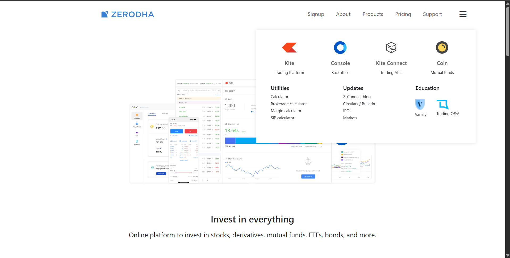
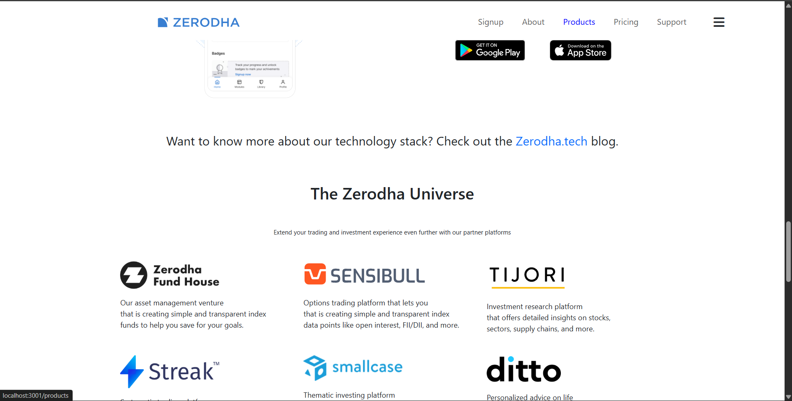
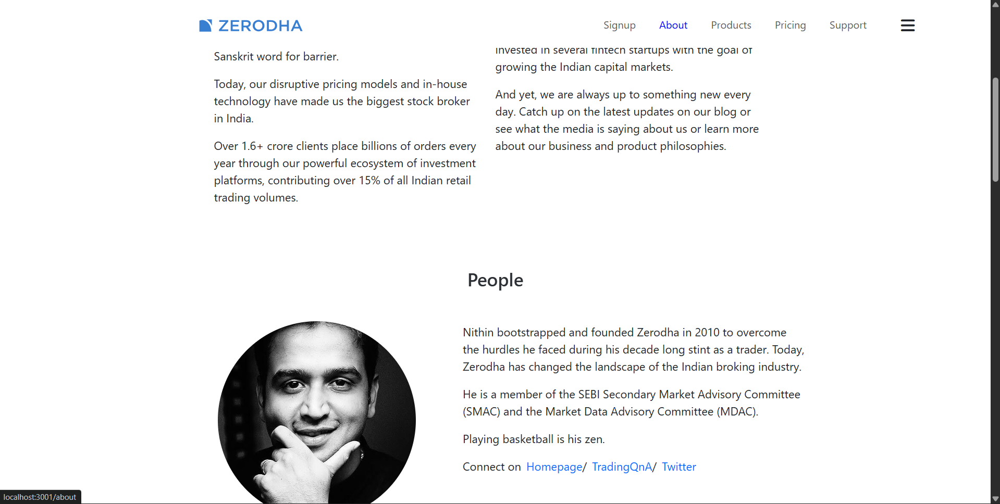
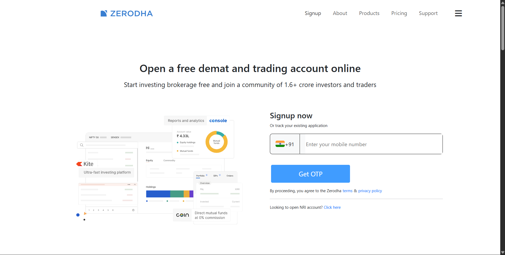
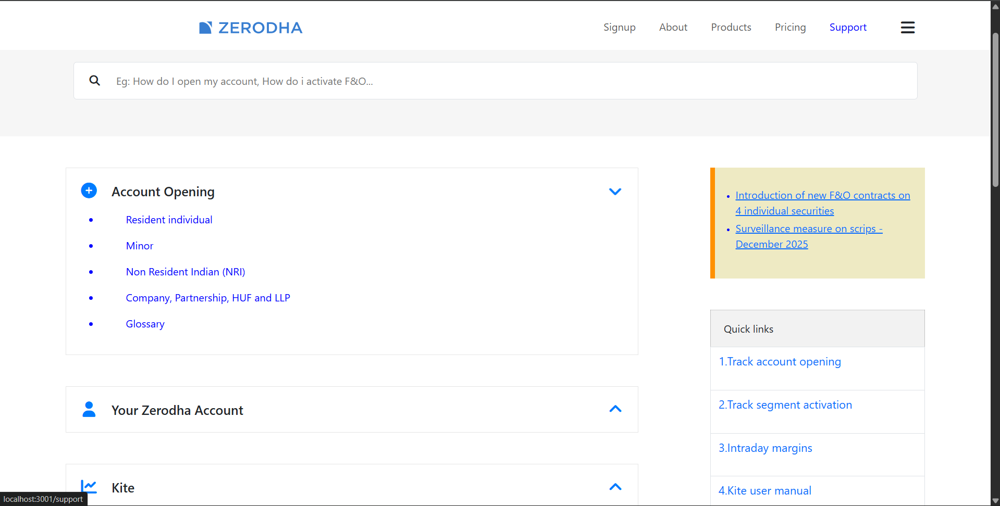
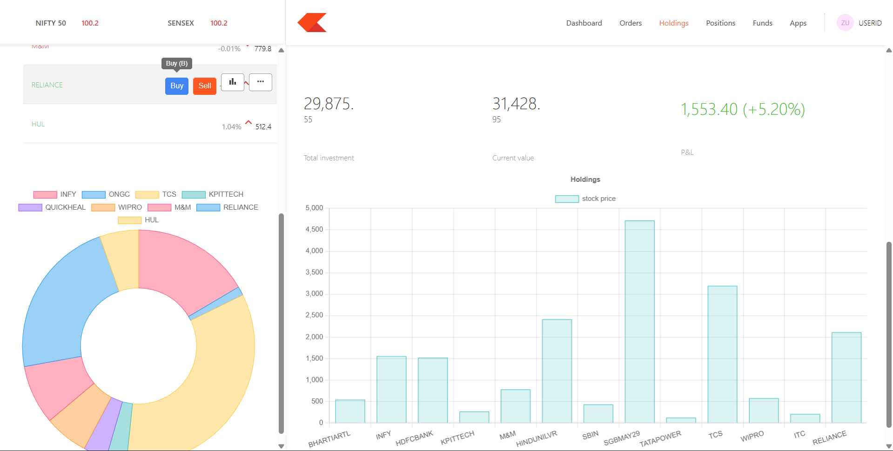

# Zerodha Clone (MERN Stack)

A **Zerodha-inspired trading platform UI clone** built for learning full-stack development.
The project includes a **landing page and a simplified Kite-style dashboard**.

---

## Tech Stack

**Frontend**

* React
* CSS

**Backend**

* Node.js
* Express.js
* MongoDB
* Mongoose

---

## Project Structure

```
ZERODHA_CLONE
│
├── backend        # Express APIs
├── dashboard      # React dashboard (Kite-like UI)
├── frontend       # Landing page
├── images         # Project screenshots
└── README.md
```

---

# Screenshots

## Landing Page



---

## Products Page



---

## About Page



---

## Sign Up Page



---

## Support Page



---

## Dashboard



---

## Installation

Clone the repository

```bash
git clone https://github.com/thejas-bk/zerodha-clone.git
cd zerodha-clone
```

### Backend

```
cd backend
npm install
npm start
```

### Frontend (Landing Pages)

```
cd frontend
npm install
npm start
```

### Dashboard

```
cd dashboard
npm install
npm start
```

---

## Features

* Zerodha inspired landing page
* Kite-style trading dashboard
* Holdings UI
* Buy window
* Express REST APIs
*jest unit tests

